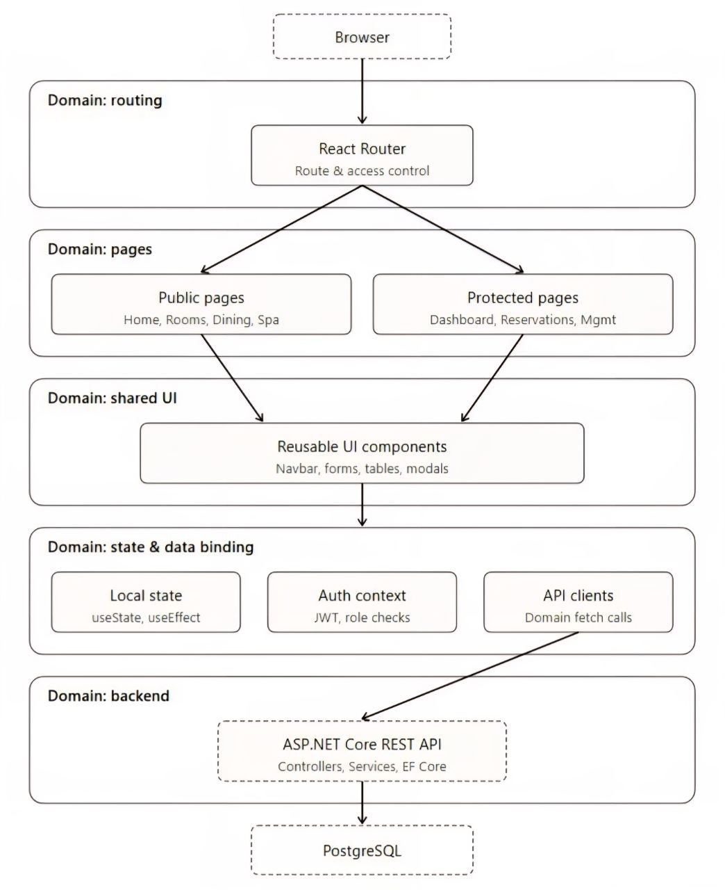
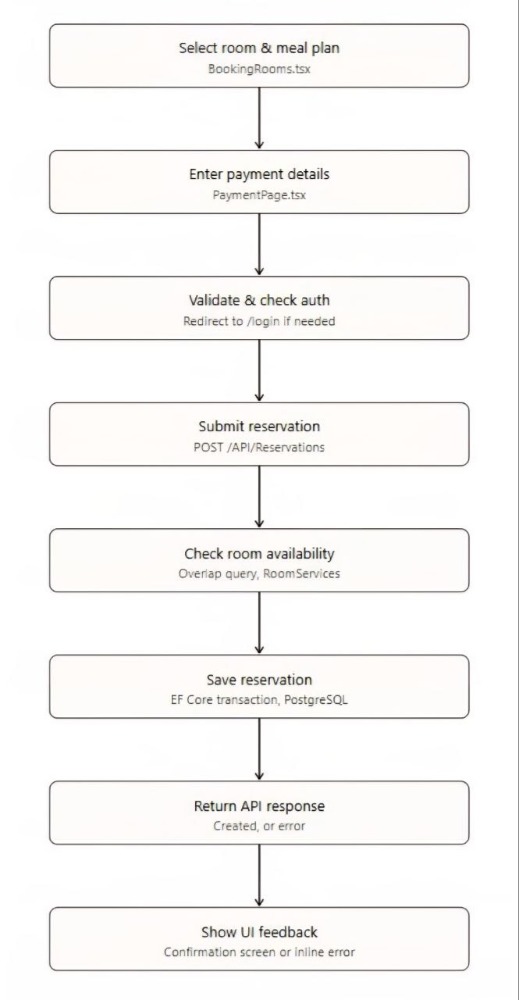
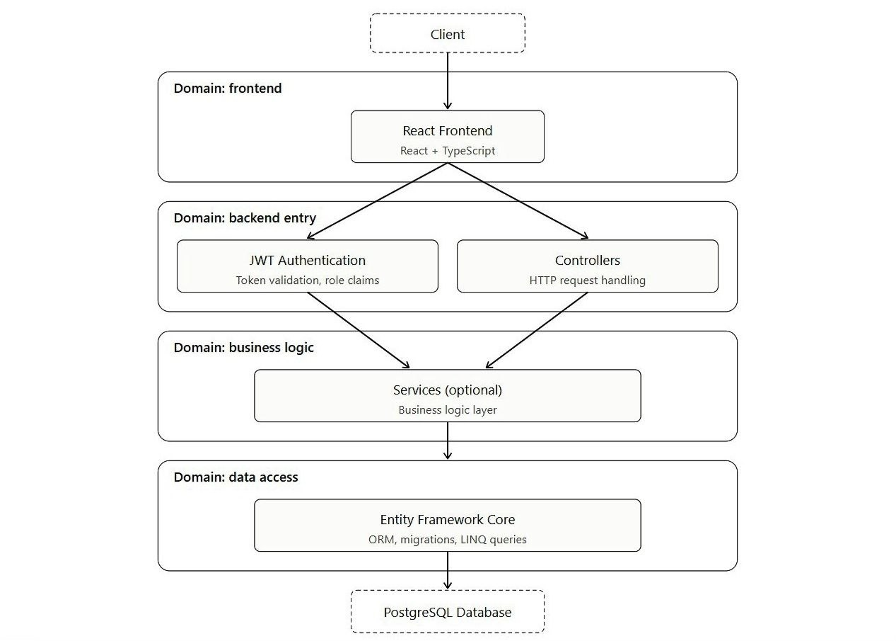

# 🏨 Noire Palace — Hotel Management System

A full-stack hotel management platform built with **React, TypeScript, ASP.NET Core 9, PostgreSQL, and Docker**.

Noire Palace is more than a hotel showcase website. It combines a customer-facing hospitality platform with authenticated user functionality and management/control panels. The frontend handles real application logic including authentication, protected routes, API integration, dynamic data, reservation workflows, forms, validation, error handling, state management, and responsive UI/UX.

The project was developed collaboratively, with my primary responsibility being the **frontend architecture, functionality, API integration, authentication flows, customer experience, and management interfaces**.

---

# Technical Highlights

**Frontend:** React, TypeScript, Vite, React Router, Tailwind CSS, Framer Motion

**Application Engineering:** REST API integration, authentication, authorization, protected routes, state management, dynamic data, forms, validation, error handling, CRUD workflows

**Core Features:** Room reservations, restaurant reservations, user authentication, management/control panels, API-driven workflows

**UI/UX:** Responsive design, reusable components, interaction design, animations, visual hierarchy, customer and management UX

**Engineering:** Git/GitHub, collaborative development, debugging, API contracts, system design, Docker, Docker Compose

---

#  Table of Contents

* [Project Overview](#-project-overview)
* [Key Features](#-key-features)
* [Frontend Architecture](#-frontend-architecture)
* [Authentication & Authorization](#-authentication--authorization)
* [API Integration](#-api-integration)
* [Reservation Workflows](#-reservation-workflows)
* [Control Panels](#-control-panels)
* [UI/UX & Interaction Design](#-uiux--interaction-design)
* * [Screenshots](#-screenshots)
* [Diagrams](#-diagrams)
* [Testing & Debugging](#-testing--debugging)
* [Running with Docker](#-running-with-docker)
* [Backend](#-backend)


---

#  Project Overview

The application is divided into two major frontend experiences:

### Customer Platform

Users can:

* Browse and explore rooms
* View dynamic hotel information
* Make room reservations
* Make restaurant reservations
* Interact with hotel services
* Register and log in
* Access authenticated functionality

### Management & Control Platform

Authenticated staff/users can interact with operational functionality through dedicated control interfaces.

These interfaces focus on:

* Managing hotel data
* Working with reservations
* Managing resources
* Performing operational actions
* Viewing dynamic backend data
* Using protected functionality

This required building both a **customer-oriented UX** and a **data-oriented management interface** within the same application.

---

#  Key Features

*  Authentication & authorization
*  Protected routes and authenticated application areas
*  Dynamic room and hotel data
*  Room reservation workflows
*  Restaurant reservation system
*  Management/control panels
*  REST API integration
*  Form handling and validation
*  API and user-facing error handling
*  Dynamic state and data updates
*  Responsive design
*  Framer Motion animations
*  Reusable React components
*  Dockerized development environment


---

#  Frontend Architecture

The frontend follows a component-based architecture with separation between pages, reusable components, application state, routing, and API-driven functionality.

```text
React Application
│
├── Pages
│
├── Reusable Components
│
├── Authentication
│
├── Protected Routes
│
├── Forms & Validation
│
├── Application State
│
└── REST API Integration
        │
        ▼
   ASP.NET Core API
        │
        ▼
    PostgreSQL
```

A typical feature follows:

```text
User Interaction
      ↓
React State / Form
      ↓
Validation
      ↓
API Request
      ↓
Backend Processing
      ↓
API Response
      ↓
State Update
      ↓
UI Update
```

---

#  Authentication & Authorization

Authentication was implemented across both the backend and frontend.

The frontend handles the complete user experience surrounding authentication, including:

* Login
* Registration
* Authentication state
* Token handling
* Logout
* Redirects
* Protected routes
* Conditional rendering
* Authenticated API requests

Protected areas are separated from public hotel pages so that management functionality cannot simply be accessed through normal navigation.

```text
User
 ↓
Login
 ↓
API Authentication
 ↓
JWT
 ↓
Frontend Authentication State
 ↓
Protected Routes
 ↓
Authenticated Application
```

---

#  API Integration

The React application communicates with the backend exclusively through REST APIs.

Frontend responsibilities include:

* Constructing request payloads
* Sending HTTP requests
* Processing JSON responses
* Handling authentication headers
* Updating application state
* Handling API errors
* Handling backend validation responses

This required maintaining consistency between the TypeScript frontend models, API endpoints, request DTOs, response structures, and date/time formats.

---

#  Reservation Workflows

Reservation functionality is one of the main application workflows.

The frontend manages the complete interaction from user input to API response:

```text
Select Service / Room
        ↓
Date & Time
        ↓
Guest Information
        ↓
Frontend Validation
        ↓
Request Construction
        ↓
REST API
        ↓
Availability / Business Validation
        ↓
Reservation Result
        ↓
Success / Error Feedback
```

The restaurant reservation workflow also handles information such as:

* Guest capacity
* Date
* Time
* Email
* Special requests

The frontend must correctly construct the request while handling unavailable resources, invalid input, conflicting reservations, and backend validation errors.

---

#  Control Panels

A significant part of the project is dedicated to authenticated management interfaces rather than the public hotel website.

These interfaces provide data-driven functionality for hotel operations and include:

* Protected management areas
* Dynamic data
* Forms
* CRUD-style operations
* Status handling
* API communication
* User feedback
* Conditional rendering

This required designing a different UX for operational users:

**Customer interface**

> Discovery → Experience → Booking

**Management interface**

> Information → Operations → Actions

---

#  UI/UX & Interaction Design

UI/UX was an important part of the project while remaining integrated with the application's functionality.

The customer-facing experience follows a luxury hospitality design language using:

* Strong typography
* Large imagery
* Visual hierarchy
* Responsive layouts
* Consistent spacing
* Clear calls to action
* Interactive components

The management interfaces prioritize:

* Information hierarchy
* Readability
* Efficient navigation
* Clear actions
* Forms and data presentation

**Framer Motion** was used for controlled animations and interactions including page transitions, component entrances, hover effects, and other motion-based interactions.

---

# Screenshots

Selected screenshots of the Noire Palace frontend are available in [`Hotel/frontend/docs/screenshots`](Hotel/frontend/docs/screenshots).

They showcase both sides of the application, including the customer-facing hotel experience, booking and restaurant workflows, authentication, and management/control interfaces.

The screenshots are provided as visual references for the frontend architecture, functionality, and UI/UX described throughout this README.

---

# Diagrams

The project documentation includes diagrams for the most important architectural and functional workflows.


### System Architecture



### Room Reservation Flow



### Whole Stack Architecture




### Role & Access Control

```text
                 User
                  │
          Authentication
             /        \
       Customer      Staff/Admin
          │              │
          ▼              ▼
     User Features   Control Panels
```

---

#  Testing & Debugging

Development involved debugging across the complete frontend/backend request lifecycle.

Tools and techniques included:

* Browser DevTools
* Network request inspection
* HTTP status analysis
* Request/response inspection
* Swagger
* Backend logs
* Database query inspection

This was particularly useful when debugging reservation workflows where frontend payloads, backend DTOs, validation logic, and database queries all had to agree.

---


#  Running with Docker

The entire project (backend, frontend, and database) is fully containerized and can be run with a single command using Docker Compose.

### Prerequisites

* Docker Desktop installed and running

### Services

* ASP.NET Core Backend (Web API)
* React Frontend
* PostgreSQL Database

### Run the Project

Clone the project on your own device
with:

```bash
git clone https://github.com/KianSharifan/Hotel
```

then:

```bash
cd hotel
```

at the end:

```bash
docker compose up --build
```

This will build the backend and frontend images, start a PostgreSQL container, apply database migrations, and seed the database automatically on first run.

### Access the Application

| Service  | URL                   |
| -------- | --------------------- |
| Frontend | http://localhost:3000 |
| Backend  | http://localhost:5263 |
| Postgres | localhost:5432        |

Default development database credentials: `postgres` / `postgres`

### Stopping the Project

```bash
docker compose down
```

### Resetting the Database

```bash
docker compose down -v
```


---


#  Backend

The backend is implemented using **ASP.NET Core 9, Entity Framework Core, PostgreSQL, JWT authentication, and a layered architecture**.

It provides the REST APIs, business logic, database access, authentication infrastructure, reservation logic, and hotel-management services consumed by the frontend.

For detailed backend architecture, database design, migrations, services, authentication, and backend testing:
**Backend Repository:**
https://github.com/KianSharifan/Hotel

---


